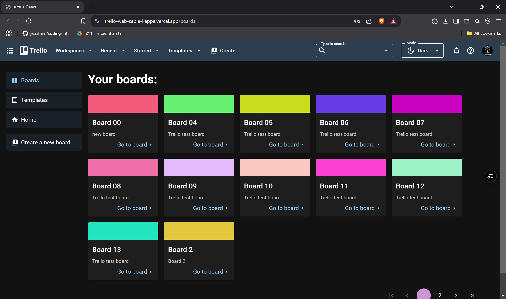
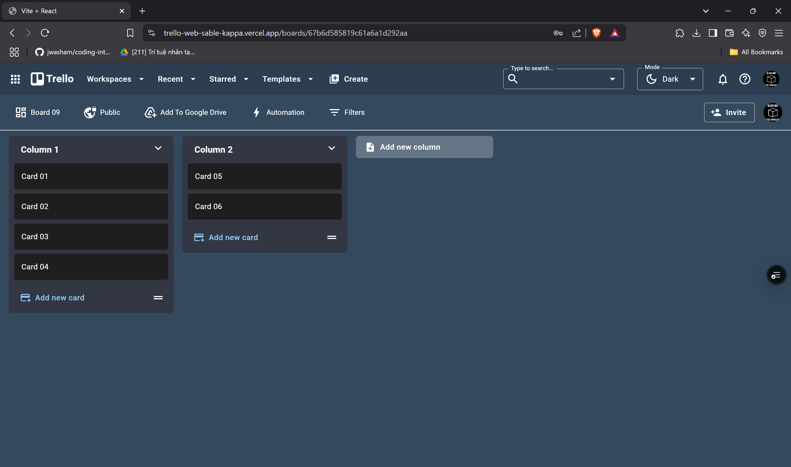
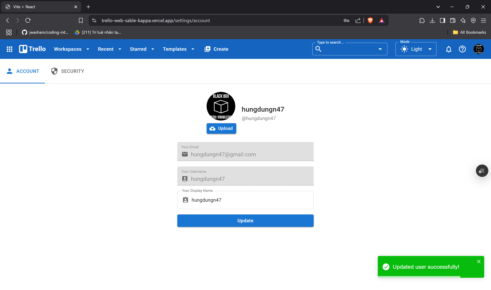
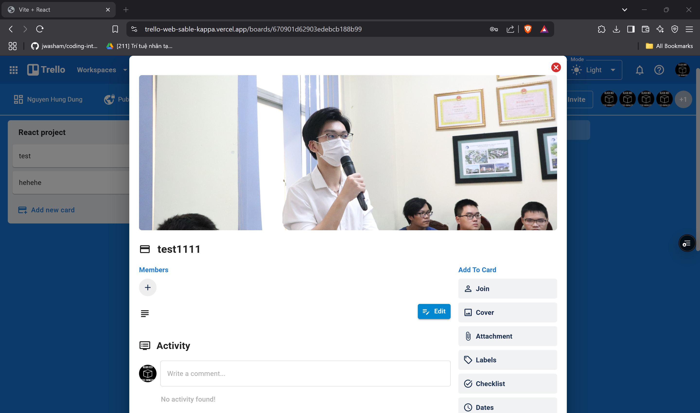

# 📝 Trello Web Clone - Frontend  

Trello is an intuitive and powerful tool for organizing ideas, tasks, and workflows.  
It allows teams to manage projects with a **drag-and-drop interface**, featuring lists and cards that store **comments, attachments, and collaboration tools**.  

## 🛸 Deployment
Website deployment is available at: https://trello-web-sable-kappa.vercel.app/  
APIs are available at: https://trello-api-aqqf.onrender.com

## 🚀 Features  

✅ **User Authentication**      
- Login - register - logout with JWT token
- Email verification for new accounts
- Auto refresh token mechanism
    
✅ **User Profile Management**    
- Update user info: displayName, password
- Upload avatar (using Cloudinary)

✅ **Theme switching**    
- Select app theme: light, dark or system-based

✅ **Board Management**     
- Create board
- See board list with pagination and responsive grid
- See board details, update board info

✅ **Invite user**   
- Invite users to board, with real time execution by using socket

✅ **Column management**   
- Create and delete column, update column title
- Use dnd-kit to drag and drop columns in a board

✅ **Card Management**    
- Create and delete card, update card title
- Use dnd-kit to drag cards in one column or between different columns in a board
- Add comments to card

---

## 🛠️ Tech Stack  

🔹 **Runtime**: Node.js  
🔹 **Frontend**: React.js, Redux, dnd-kit, socket.io, Material-UI    
🔹 **Backend**: ExpressJS, socket.io, multer, cloudinary
🔹 **Database**: MongoDB    

## 📸 Screen shots

### Board list screen

### Board list screen dark mode

### Board details screen

### Profile screen

### Card details modal
